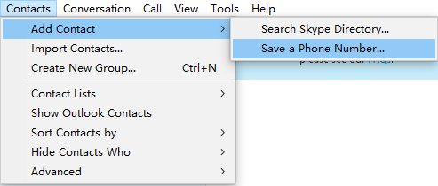
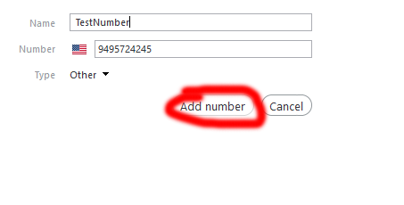
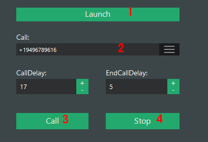

# Skypebot
Note* This application is mainly for anti-spam. You are solely responsible for compliance with the laws and regulations applicable to your place or country of residence and accessing this application from any country where its content does not comply with its laws and regulations is prohibited. 

# Usage:
1. install skype - double click SkypeSetupFull.exe

2. register, login, add skype credit

3. unzip bin.zip and click SkypeBot.exe to launch

4. agree the legal statement

5. send product ID to skype4bot@gmail.com

6. after get product key. click ok. 

7. click launch

8. in the skype windows click allow access
    

9. add contact number

    

    

10. select contact number

   

11. click start

12. click stop

